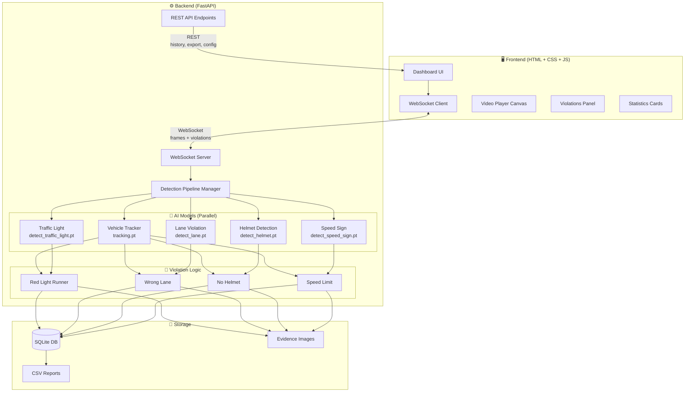
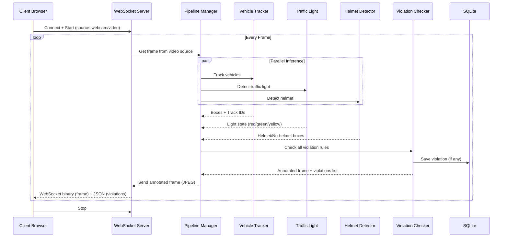

# 🚦 TrafficAI - Traffic Violation Detection System

Chào mừng đến với **TrafficAI**, hệ thống tự động phát hiện và cảnh báo vi phạm giao thông theo thời gian thực (Real-time). Hệ thống ứng dụng công nghệ Deep Learning (YOLO) để nhận diện các hành vi vi phạm giao thông trên các đoạn đường bao gồm:
1. **Lỗi vượt đèn đỏ** (Red-light running)
2. **Lỗi đi sai làn đường** (Wrong-lane driving)
3. **Lỗi không đội mũ bảo hiểm** (Helmetless rider)
4. **Lỗi vượt quá tốc độ** (Speed limits violation) 

Toàn bộ quá trình theo dõi, nhận diện và bắt bằng chứng vi phạm được truyền tải (stream) trực tiếp theo thời gian thực lên giao diện web qua WebSocket!
---

## Kiến trúc hệ thống



## Luồng xử lý (Pipeline)




---

## 📂 Kiến trúc Thư mục (Directory Structure)

```text
/AIClub_NAS/nguyenmv/duytk/duytk/CV/project/
├── webapp/                 # Thư mục gốc chứa Web
│   ├── backend/            # Khối xử lý Logic (FastAPI, YOLO, OpenCV)
│   │   ├── main.py         # Entrypoint, Web APIs và WebSocket Server
│   │   ├── pipeline.py     # Lõi xử lý từng khung hình video theo chuỗi
│   │   ├── violation_checker.py # Logic khoanh vùng vi phạm (polygon, lane tracking...)
│   │   ├── models_loader.py# Quản lý vòng đời load file Weights YOLO
│   │   └── database.py     # Quản lý lưu trữ/truy vấn SQlite
│   ├── frontend/           # Khối hiển thị Giao diện (HTML/Vanilla JS)
│   │   ├── index.html      # Giao diện Dashboards trung tâm
│   │   ├── css/            # Thư mục cấu hình phong cách (Aesthetics)
│   │   └── js/app.js       # Script điều hành giao diện và kết nối WS
│   ├── models/             # 📌 Thư mục chứa các model file (.pt)
│   ├── uploads/            # [Tự sinh] Lưu video do người dùng upload để phân tích nhanh
│   └── evidence/           # [Tự sinh] Lưu ảnh bằng chứng (Crop) chụp được khi xe vi phạm
├── run.py                  # File mồi khởi chạy máy chủ backend
├── start_server.sh         # Shell script tự động cài đặt môi trường và chạy Server
└── README.md               # Tổng quan dự án (File này)
```

---

## 🛠️ Chẩn bị Tài nguyên (Resources Download)

Hệ thống cần các Model Tracking và Classification để hoạt động. Đảm bảo bạn đã đặt các file model Weights (ví dụ: `.pt`) và file cấu hình `.yaml` theo cấu trúc sau trong thư mục `webapp/models/`:

- `tracking.pt` (Tracking xe chung)
- `detect_traffic_light.pt` (Nhận diện Đèn đỏ/xanh)
- `detect_lane.pt` (Nhận diện biển báo hướng đi làn)
- `detect_nohelmet.pt` (Nhận diện mũ bảo hiểm)
- `bytetrack.yaml` (File config cài đặt bộ Tracker)

*Lưu ý: Nếu một model bất kì bị thiếu, hệ thống sẽ tự động tắt tính năng vi phạm của khối module đó mà không bị crash.*

---

## 🚀 Hướng dẫn Cài đặt & Khởi động (How to Run)

Dự án được cấu hình chạy trong môi trường Container và Conda nội bộ. Thực hiện theo trình tự sau:

1. **Truy cập vào Container và Environment:**
   Mở terminal và chui vào Docker:
   ```bash
   docker exec -it opencubee bash
   ```
   Kích hoạt môi trường conda chứa đủ các thư viện ảo (`ultralytics`, `fastapi`, `opencv-python`...):
   ```bash
   conda activate cv
   ```
   Tải các thư viện cần thiết:
   ```bash
   cd webapp/backend/
   pip install -r requirements.txt
   ```
2. **Di chuyển vào thư mục làm việc gốc:**
   ```bash
   cd /AIClub_NAS/nguyenmv/duytk/duytk/CV/project/
   ```

3. **Chạy Server:**
   Khuyến nghị khởi động bằng shell file có sẵn (đã được cấu hình tự động chọn GPU #0 để load Model, tránh xung đột VRAM):
   ```bash
   ./start_server.sh
   # Trường hợp file chưa cấp quyền, chạy lệnh: chmod +x start_server.sh
   ```

   *Hoặc bạn có thể chạy tay (manual):*
   ```bash
   CUDA_VISIBLE_DEVICES=0 python run.py
   ```

4. **Trải nghiệm ngay trên trình duyệt:**
   Sau khi console báo `Uvicorn running on http://0.0.0.0:5000`, bạn hãy mở trình duyệt web và truy cập vào địa chỉ:
   👉 **http://localhost:5000**

---

## 💡 Hướng dẫn sử dụng & Luồng Video (Usage Workflow)

- **Kết nối Video Feed:** Ở giao diện chính, bạn có thể chọn 3 cách mồi Video:
  1. `Webcam`: Trực tiếp lấy luồng hình ảnh từ máy tính (nếu có gắn Webcam).
  2. `URL Camera`: Hỗ trợ bạn ném link Camera IP tĩnh (HTTP / RTSP) từ một cái camera ngoài ngã tư thật.
  3. `Upload Video`: Tải 1 đoạn clip .mp4, .avi có sẵn trong máy tính lên server để test thử nhận diện.
- Hệ thống hỗ trợ **Auto-clean (tự động dọn rác)**. Các video upload sẽ luôn được hệ thống xóa sạch khỏi ổ cứng NAS ngay khi phát xong 100% hoặc khi người dùng bị mất mạng/f5 web giữ chừng, để tránh ngốn bộ nhớ!
- Bảng Dashboard có hỗ trợ **Export CSV** (Tải lịch sử vi phạm đuôi .csv) để lập report.
- Click trực tiếp vào các ô chữ nhật báo cáo vi phạm ở History List (Cột bên phải) để phóng to hình ảnh bằng chứng xe vi phạm.

---
🎯 Chúc bạn có những phút giây trải nghiệm phát triển tuyệt vời với **TrafficAI**!
